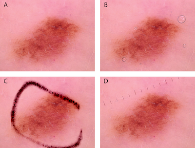

# Dermatoscopic artefact insertion
 
[](https://creativecommons.org/licenses/by-nc/4.0/)


> Katsch F, Rinner C, Tschandl P. Comparison of convolutional neural network architectures for robustness against common artefacts in dermatoscopic images. **Dermatol Pract Concept** 2022 [manuscript accepted]

## What it does

This tool inserts clinically meaningful artefacts to dermatoscopic images. We focused on three artefact types commonly present in dermatoscopic images: *bubbles*, *rulers* (with two subcategories *horizontal & vertical rulers*) and *ink markings* (divided in *spot & circle markings*).

To achieve this, templates were extracted from artefacts in dermatoscopic images. The folder `/data/artefacts` contains 51 instances of source images and extracted artefacts thereof. Basically, the regions of artefacts were isolated from source images and repaired with Adobe Photoshops content aware image restoration mechanism - "spot healing brush". A more detailed description of this process can be found in [data/artefacts/README.md](data/artefacts/README.md).

Those templates are then superimposed into new images, in a pseudo random process (e.g. position and orientation of artefacts in the image) as defined in `src/types.py`.

The figure below shows examples of automatically superimposed artefacts on a dermatoscopic image. In the top left (A) the original image without artefact is shown. The other three images show the lesion with the superimposed artefacts bubbles (B), ink markings (C) and a ruler (D).




## How to install

Use the provided Pipfile to install dependencies: 
```sh
$ pipenv install
```
You can then try out the demo with the following command:
```sh
$ pipenv run python ./demo.py
```


## How to use

Each artefact template is abstracted as an Artefact class (and specializations thereof, see `src/types.py`) which can be obtained from the `ArtefactsRepository`. Each artefact template implements the `__call__` operation which can be used with an image and optionally with a mask as parameter and returns an image with inserted artefacts.

See `demo.py` for more examples:

```sh
# load image and repository
im = Image.open('data/test_images/ISIC_0024311.jpg')
mask = Image.open('data/test_masks/ISIC_0024311.png')
repo = artefactsRepository('data/artefacts/meta.json', seed=2022)

# for all available artefact classes
for type in [Bubble, RulerVertical, RulerHorizontal, MarkingCircle, MarkingSpot]:

  # obtain artefact object of type t
  artefact = repo.get_random_instance(type)

  # apply artefact to image
  im_with = artefact(im, mask)

  im_with.show()
```


## Credits

All image files and segmentation masks contained in this package originate from the [HAM10000](https://doi.org/10.1038/sdata.2018.161) dataset, obtained from [dataverse.harvard.edu](https://dataverse.harvard.edu/dataset.xhtml?persistentId=doi:10.7910/DVN/DBW86T). Those images are published under the [CC BY-NC-SA 4.0](https://creativecommons.org/licenses/by/4.0/) license by  the Medical University of Vienna. Thank you!

> Tschandl, P., Rosendahl, C. & Kittler, H. The HAM10000 dataset, a large collection of multi-source dermatoscopic images of common pigmented skin lesions. **Sci Data** 5, 180161 (2018). https://doi.org/10.1038/sdata.2018.161


## How to reference

This project is released under the [CC BY-NC-SA 4.0 license](https://creativecommons.org/licenses/by-nc-sa/4.0/) - see [LICENSE](LICENSE)

It was developed in the context of my master thesis, with the title *"[Analysis of image classification, object detection and instance segmentation in terms of robustness to artefacts in automated pigmented skin lesion classification](https://repositorium.meduniwien.ac.at/urn:nbn:at:at-ubmuw:1-32614)"* at the Medical University of Vienna in 2020, and used in this paper:

> Katsch F, Rinner C, Tschandl P. Comparison of convolutional neural network architectures for robustness against common artefacts in dermatoscopic images. **Dermatol Pract Concept** 2022 [manuscript accepted]
