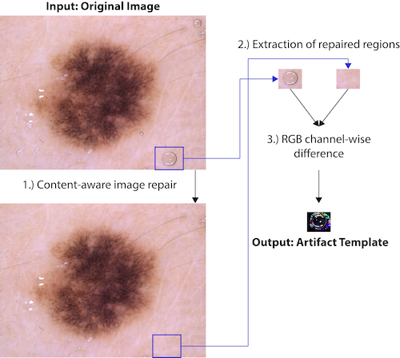

# Artefact sources
This folder contains dermatoscopic image instances and derivations thereof from the HAM10000 dataset with artefacts present of one of the three observed artefact classes.

## Preprocessing

After manual selection of suitable dermatoscopic images in different datasets (in the original work also images from the [PH2](https://www.fc.up.pt/addi/ph2%20database.html) and [EDRA](https://espace.library.uq.edu.au/view/UQ:229410) / [7-point criteria](https://derm.cs.sfu.ca/) dataset were used, because of licensing issues those images are not contained in this repository), some were selected to extract artefacts from. Artefacts in the chosen images were sliced into regions of interest and then for each region the artefacts were removed by  manually repairing the region with Adobe® Photoshops® (version CC 2018 (19.1.9), Adobe Inc., San José, USA) content aware image repair mechanism. The result are two different images for each artefact (original and repaired) saved in *.png format with 8 Bit per channel and no transparency. Some other artefacts (some rulers) were extracted directly and will be used as stamp. For each image several artefacts are extracted, and one *.psd file is stored for further use.

The figure below depicts this **workflow for extracting artefact templates:** 
- Manually selected original images (Input) were repaired manually (1), and 
- corresponding image areas extracted (2). 
- The channel-wise difference (3) was stored as a template for the corresponding artefact type.

  
*Source: Katsch F et al. Dermatology Practical & Conceptual 2022*

## Types

This package knows three types of artefacts:

- **Bubbles**: usually do not occur isolated, therefore a certain number of bubbles are inserted in the new image. In order to achieve this, the difference between an image with the artefact present and one without (manually removed earlier) of the same source image on the same position is taken and inserted in the new image. 
  The position and the number of insertions is chosen randomly within some reasonable boundaries. If a lesion segmentation mask is given, the algorithm decreases the probability of placing it on top of the lesion.
  Bubbles are represented in code via the `<src.types.Bubble>` class. Some default values for different probabilistic values can be found there.
- **Markings**: some examples of markings were preprocessed and isolated from surrounding skin structures. During assessing and processing of those markings, two distinct types were distinguished. Those who are centered around a lesion and form some kind of circular structure and those who are scattered in the whole image or have only one single position. Markings are therefore represented by either the `<src.types.MarkingCircle>` or the `<src.types.MarkingSpot>` class to address those different placing strategies.
- **Rulers**: while preprocessing the artefacts there were two different rulers present in the data. Some of them in the center of the image (to some extent overlapping the lesion) and some of them in peripheral areas of the image (mostly in corners). Rulers will be placed matching their original basic orientation (again with variation in position). Again, to represent those different types of Rulers two classes
  (`<src.types.RulerHorizontal>` and `<src.types.RulerVertical>`) are used.

## Structure

- `meta.json` : All prepared artefacts are described in this file for easy access. This file contains a list of artefacts each having at least the required fields `class` (type of artefact, currently ether bubble, marking or ruler), `source` (license information), `artefact_folder` (location to the artefact images). Several additional fields are used.
- `src/[image_id].jpg` : source images, where the artefact instances are taken from.
- `src/[image_id]/*.png` : artefact instances, depending on the type of preprocessing used ether pairs of images or just single images.
- `src/[image_id]/*.psd`: intermediate result of the preprocessing.

## Credits

All images files and segmentation masks contained in this package originate from the [HAM10000](https://doi.org/10.1038/sdata.2018.161) dataset, obtained from the [dataverse.harvard.edu](https://dataverse.harvard.edu/dataset.xhtml?persistentId=doi:10.7910/DVN/DBW86T). Those images are published under the [CC BY-NC-SA 4.0](https://creativecommons.org/licenses/by/4.0/) license by Tschandl Philipp (Medical University of Vienna). Thank you!

> Tschandl, P., Rosendahl, C. & Kittler, H. The HAM10000 dataset, a large collection of multi-source dermatoscopic images of common pigmented skin lesions. **Sci Data** 5, 180161 (2018). https://doi.org/10.1038/sdata.2018.161

